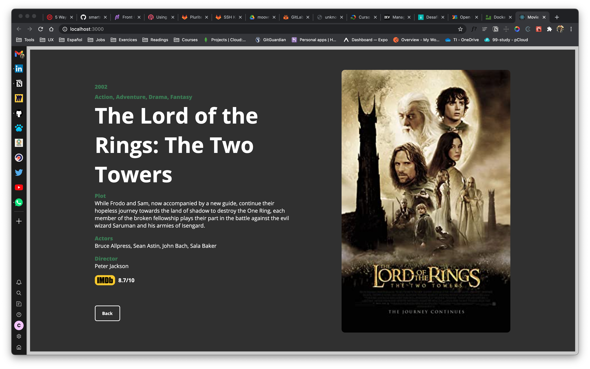

# Movie Box

Aplicativo web para pesquisa de filmes que permite salvar favoritos e obter maior detalhes do filme selecionado.




## Rodando o Aplicativo

```
git clone https://github.com/javi-domi/moviebox-challenge.git
cd moviebox-challenge
docker-compose up
```

## Frontend

Desenvolvido en React e utilizando estilos próprios.

O frontend roda na porta 3000:

```
http://localhost:3000
```

## Backend

O backend roda na porta 8080:

```
http://localhost:8080
```

### Pesquisa por título

Utilizando a API [OMDb API](http://www.omdbapi.com/) criaram se dois endpoints un para realizar a busca por título:

```js
const getMovies = async (req, res) => {
  const url_api = `http://www.omdbapi.com/?s=${req.params.title}&plot=full&apikey=${process.env.API_KEY}`;

  axios
    .get(url_api)
    .then((response) => {
      res.send(response.data.Search);
    })
    .catch((error) => {
      console.log(error);
    });
};
```

### Pesquisa por ID

O segundo endpoint faz a requisição por ID do filme que fornece mais detalhes sobre o filme:

```js
const getById = async (req, res) => {
  const url_api = `http://www.omdbapi.com/?i=${req.params.id}&plot=full&apikey=${process.env.API_KEY}`;
  axios
    .get(url_api)
    .then((response) => {
      res.send(response.data);
    })
    .catch((error) => {
      console.log(error);
    });
};
```

este endpoint tem como parâmetro o id do filme selecionado na pesquisa por título, fazendo click no poster, abre um modal con toda a informação:

```js
const handleModalPersist = async (movie) => {
  const fullMovieInfo = await MovieService.useID(movie.imdbID);

  setSelectedMovie(fullMovieInfo.data);

  setIsModalOpen(true);
};
```
